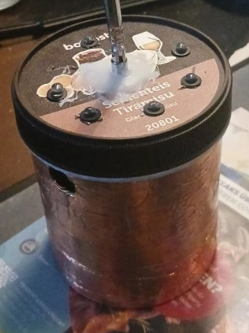

# 👻 GhostPod

**The ghost detector that sniffs the air – and mines Bitcoin while doing it.**

*[Deutsche Version](README.de.md)*

An ESP32 in a tiramisu ice-cream tub. A telescopic antenna on top, copper tape around the side, six LEDs in the lid. Inspired by the "REM pods" from ghost-hunting TV shows – basically half a theremin: the antenna builds a field, and anything conductive nearby detunes it.

Unlike the TV gadgets, the GhostPod doesn't hunt ghosts in abandoned houses without internet. It hunts them in **SHA-256 space** – as a real Stratum miner at about **786 kH/s**. The antenna supplies real physical entropy (capacitance, mains hum, noise), which decides *where* in the search space the tub looks for its ghost.

> **Honest note 😉**
> The antenna does not make the tub any luckier. Every nonce is a lottery ticket with exactly the same odds – whether counted up from 0 or picked by a ghost. The antenna decides *which* tickets are drawn, not *how many*. On the real Bitcoin network the GhostPod finds a block on average every **~22 billion years**. The chance per day is about **0.000000000012 %**. But it isn't zero. 👻

---

## Gallery

<p align="center"></p>
<p align="center"><i>The GhostPod: tiramisu ice-cream tub, copper tape as counterpoise, telescopic antenna in hot glue, six LEDs in the lid.</i></p>

---

## What the LEDs mean

Lid seen from above, antenna in the middle:

```
                🔴 12 o'clock – share
   🔴 9 o'clock                  🔴 3 o'clock
   sign of life      📡          high score

   🟢 steady               🟢 blinker
                🔴 6 o'clock – BLOCK (heart)
```

| LED | Meaning | Threshold |
|---|---|---|
| 9 o'clock | sign of life – "something's there" | half the pool difficulty |
| 12 o'clock | **share found** – submitted to the pool | pool difficulty |
| 3 o'clock | **high score beaten** – higher than ever before | previous best |
| 6 o'clock (heart) | **BLOCK!** – beeper, 10 s poltergeist, then on for 24 h | network difficulty |

All thresholds come **from the pool itself** (`mining.set_difficulty` and `nbits`), so the GhostPod adapts to any pool – from your own fun coin to real Bitcoin.

**Green LEDs:** fast blinking = antenna is sniffing, steady + 1 Hz blink = searching, both off = showing the result.

### One round (60 s)

1. **Scan (3 s)** – the antenna "sticks its nose in the air"; the readings produce a new `extranonce2` and start nonce.
2. **Search (52 s)** – the red LEDs build up: little soul … share … high score?
3. **Result (5 s)** – the LEDs stay lit, then the next round begins.

Mining never pauses; the round only drives the display.

---

## The antenna

| | Pin | Purpose |
|---|---|---|
| telescopic rod | GPIO 33 (touch) | capacitance, mains hum, proximity |
| copper tape ring | GPIO 32 (touch) | other half of the dipole, touch sensor |
| floating ADC pin | GPIO 34 | noise |

On every new pool job (0.2 s) and at the start of each round (3 s) the antenna is sampled thousands of times. The jittering low bits, clock jitter, hardware RNG, Wi-Fi level and temperature are mixed into a SHA-256 entropy pool.

**Channel detection:** each extended segment changes the capacitance measurably, so the GhostPod knows how far the antenna is out and shows the matching quarter-wave range, e.g. *"5 of 5 segments · ~94 cm · ~80 MHz"*. The frequency is calculated, not measured (that would need an antenna analyzer); the length is real.

---

## Web page

`http://ghostpod.local/` shows the **live lid** (all six LEDs from the real pin state), the ghost hunt with round progress and current thresholds, antenna readings and channel, the persistent **ghost chronicle** (rounds, shares, high scores, blocks, uptime), the usual miner stats and an **LED test** button.

---

## Hardware

- classic ESP32 (tested: ESP32-D0WDQ6 **revision 1.0**, DevKitC with CP2102, Micro-USB)
- 4 red LEDs: GPIO 25 (9 o'clock), 26 (12), 27 (3), 14 (heart)
- 2 green LEDs: GPIO 13 (steady), 12 (blinker)
- beeper: GPIO 23
- wire bridge: GPIO 21 → GND – read once at power-up: **in** = high score is persistent, **out** = high score is forgotten and starts at zero

Revision-1 ESP32s need a workaround for a hardware erratum (DPORT) when using the SHA accelerator; it is detected and enabled automatically.

## Build and flash

```bash
pio run -t upload
```

Old Micro-USB boards don't always enter download mode by themselves – hold **BOOT** while flashing (a cotton ball under the lid works 😄). That's also why the "hold BOOT to factory-reset" feature is disabled.

On first start the GhostPod opens its own Wi-Fi **`GhostPod-XXXX`** (password `ghostpod`); enter your Wi-Fi, pool and wallet there. Tuning knobs live in `include/config.h`.

## History

- **Ghost Pod 1.x / 2.x** – Arduino sketch ([`legacy/`](legacy/) – the originals to read) hashing touch readings with mbedTLS (20–60 kH/s), LEDs by leading hex zeros. Version 2.6 ran for **61.7 days** and found **465 "full ghosts"**; that "era 2.6" is imported from flash and shown on the web page.
- **GhostPod 3.0** – real Stratum miner based on [ESPressMiner32](https://github.com/brenner23/ESPressMiner32), hardware SHA, LEDs by real difficulty, antenna picks the search location.

## Who did what?

Idea, concept, hardware and Ghost Pod 1.x–2.6: **brenner23**.

Firmware 3.0 is AI-assisted (Claude by Anthropic): the miner core, web page and antenna logic were written together. Requirements, testing on the real device and all decisions came from brenner23.

## Thanks

[ESPressMiner32](https://github.com/brenner23/ESPressMiner32) (miner core, Stratum, web UI, setup portal) · buffered SHA register idea from [SparkMiner](https://github.com/BitzyLabs/sparkminer) (MIT) · see [THIRD_PARTY_LICENSES.md](THIRD_PARTY_LICENSES.md)

## License

MIT – see [LICENSE](LICENSE).
